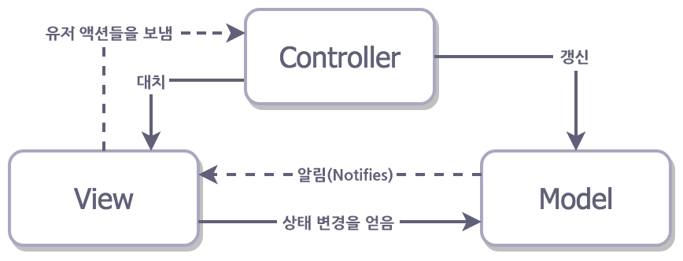
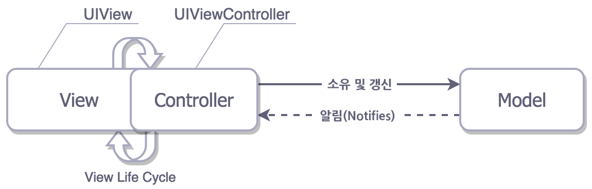
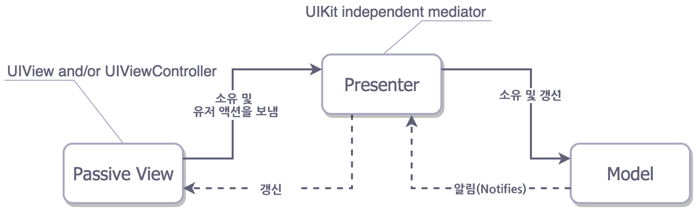
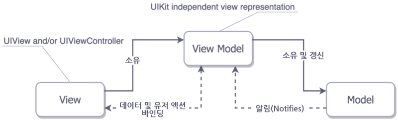

# Architecture Pattern

### 아키텍쳐 패턴이란

- 각각의 역할을 나눠서 코드를 관리하기 위한 노력 
  - 대표적으로 MV@ 패턴의 공통점은 **화면에 보여주는 로직**과 **데이터를 처리하는 로직**을 **분리**한다는 점
  - 유지보수가 쉬워진다. > 앱이 커지게 되는 경우에 **개발 효율**이 높아진다. 
- 그렇다면 좋은 아키텍쳐 패턴이란??
  1. **엄격한 룰**에 따른 개체들 간의 **균형 있는 책임분리**
     - 모든 클래스를 기억할 수 없다. 따라서 앱이 복잡할수록 나눠서 관리하는 것이 편하다.
  2. **테스트가 얼마나 용이**한지
     - 테스트가 좋다는 것은 누구나 알고 있다. 그에 따르는 비용이 크다는 것을 제외하면
  3. 사용하기 편하며 **유지보수가 용이**해야 한다.
     - 적은양의 코드는 버그가 적다. ( 거대한 덩어리를 피하자 )
     - 설명이 필요하면 안된다. ( 길어질수록 설명이 필요해진다. )

## MVC

###### 가장 전통적인 MVC

- Model + View + Controller
- ***Model*** : App 에서 사용되는 데이터와 그 데이터를 처리하는 부분
- ***View*** : 사용자에게 제공하는 UI
- ***Controller*** : 사용자의 입력을 받고 이를 처리하는 부분 ( **Action을 여기에서 받는다**. )

사실 전통적인 MVC 패턴은 Controller의 LifeCycle 과 관련해서 View와 의존도가 높기 때문에 사용하기 힘들다고 한다. 따라서 apple에서는 사실상 다음과 같은 구조를 띄고 있는 것을 흔하게 볼 수 있다.

###### Apple's MVC

거의 모든 로직이 Controller ( View 와 결합된 ) 에 존재한다. action이 controller에서 반응하고 delegate와 datasouce 등이 Controller에서 처리가 된다. 결국 대부분의 로직이 Controller에 집결하게 되고 Network 처리는 덤이다. 이로 인해서 MVC는 Massive View Controller라고 말할 때도 있다. 

실제로 작업을 하다보면 Controller의 크기를 줄여야겠다는 생각이 들고, 이때 드는 생각은 처음부터 나눴으면 좋았을 텐데 이다. 책임이 명확하게 나뉘지 않다보니 Controller가 비대해지고 이를 책임 단위로 나누는 것 또한 쉽지가 않다.

#### 동작 순서

1. Action이 **Controller** 를 통해서 들어오게 된다.
2. **Controller**는 해당 액션을 처리할 **Model**을 요구한다.
3. **Controller**는 **Model**을 받고 이를 처리할 **View**를 선택하여 보여준다.

#### 특징

- Controller : View = 1 : n 

#### 장점

- 가장 단순하다. 따라서 간단한 앱의 경우에는 개발 속도가 빨라질 수 있다.

#### 단점 

- View 와 Model 사이의 의존도가 높다. 
  - 따라서 앱이 커지게 되면 상호 업데이트가 필요하다.
- Controller가 생성되기 전 까지 test 하기가 어렵다.

## MVP 

###### MVP 

- Model + View + Presenter
- Model 과 View는 MVC와 동일 ( 단 View의 책임 범위가 줄어듬 )
- ***Presenter*** : View에서 요청한 Model 정보를 가공하여 View에 전달해주는 부분 
  - 따라서 Model은 반드시 Presenter를 거쳐서 View로 제공이 된다.
  - 또한 Presenter는 View 의 Life Cycle 에 전혀 영향을 끼치지 않는다.

#### 동작순서

1. Action이 **View**를 통해서 들어오게 된다.
   - MVC에서는 Controller에서 받았다.
2. **View**는 **Presenter**에게 **Model**을 요청한다.
3. **Presenter** 는 **Model**에게 Data를 요청한다. 
4. **Presenter** 는 **Model**을 받은 후 이를 가공한다.
5. 가공한 **Model**을 **View**에 전달한다.

#### 특징

- Presenter : View = 1 : 1 

- Presenter는 View와 Model 인스턴스를 가지고 있다.

#### 장점

- View와 Model 사이의 의존성이 없다.
  - 조금 더 테스트하기 쉽게 변경되었다.

#### 단점 

- View와 Presenter 사이의 1:1 의존성이 생긴다.

## MVVM

###### MV@ 의 최종버전 MVVM

- Model + View + View Model
- ***View Model*** : View를 표현하기 위해서 만든 Model ( View를 위한 데이터 처리 )
- **Command Pattern** 과 **Data Bindings** 기법이 사용된다.
  - Command Pattern
    - Invoker -> Receiver 
    - Invoker - Command - Receiver 로 이루어져 있으며 Invoker와 Receiver 의 의존도가 낮다.
    - 코드 참조 ( PR_Command.playground )
  - Data Binding
    - 쉽게 말해서 Model과 UI 요소간의 싱크를 맞춰주는 작업
    - 이를 통해서 View와 데이터 로직이 분리되어 있더라도 한쪽이 변경 되었을 경우 다른 쪽도 변경될 수 있도록 한다.
    - iOS 에서는 KVO, Delegation, **Property Observer**, Functional Reactive Programming 등이 있다. 

#### 동작순서

1. Action이 View를 통해서 들어오게 된다.
2. View는 View Model에게 Command Pattern을 통해서 명령을 내린다.
3. View Model은 Model 에게 Data를 요청한다.
4. Model은 View Model 에게 Data를 전달한다.
5. View Model은 데이터를 가공한다. 이때 Data Binding 으로 인해서 View Model이 변경되면 View 또한 변경된다.

#### 특징

- Command Pattern 과 Data Binding을 통한 View와 View Model 사이의 의존성 제거
- View Model : View = 1 : n  => n : 1 도 가능할듯요!

#### 장점

- 상호 의존성이 다른 패턴에 비해 낮다. 따라서 유지보수가 용이해진다.

#### 단점 

- View Model의 설계가 복잡하다.

### Reference

[[디자인패턴\] MVC, MVP, MVVM 비교](https://beomy.tistory.com/43)
[MVC, MVP, MVVM 비교](https://magi82.github.io/android-mvc-mvp-mvvm/)
[(번역) iOS 아키텍쳐 패턴들 (스압주의)](https://blog.canapio.com/43)
[[Design Pattern\] 커맨드 패턴이란 - Heee's Development Blog](https://gmlwjd9405.github.io/2018/07/07/command-pattern.html)